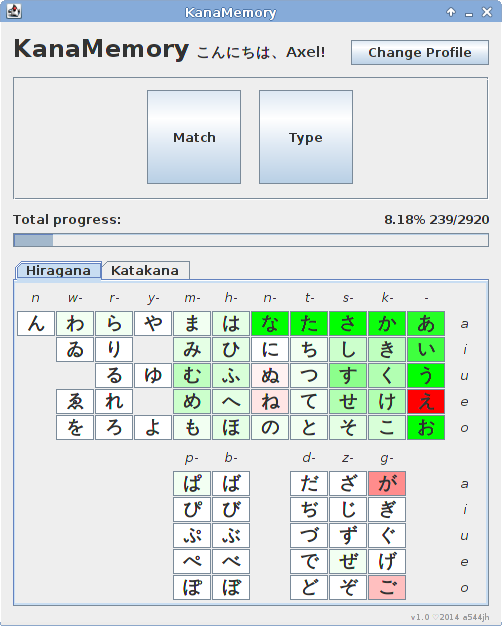

KanaMemoryGame
==============

A tool for learning the Japanese kana characters

Features:
* Visualization of the learning progress with colours
* User profiles
* Ability to choose the set of characters to learn at a time
* Configurable activities

